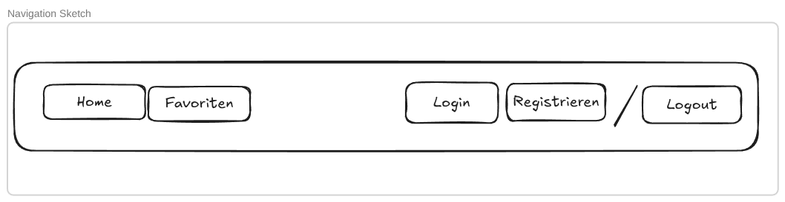
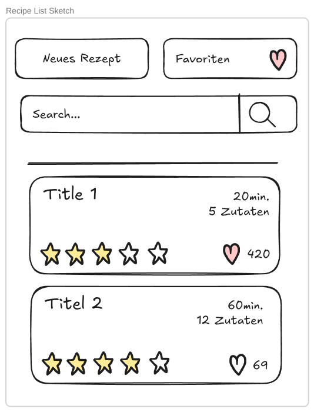
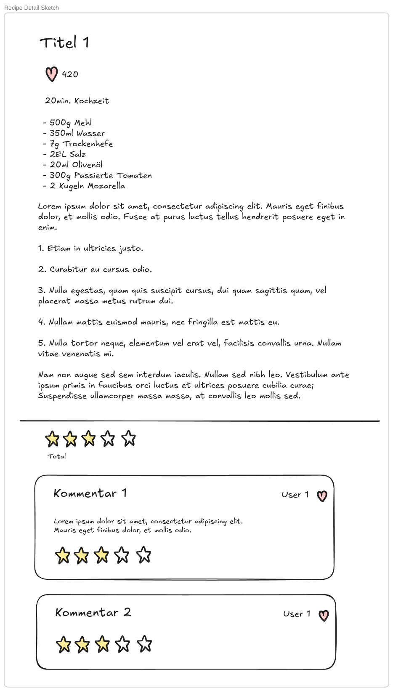
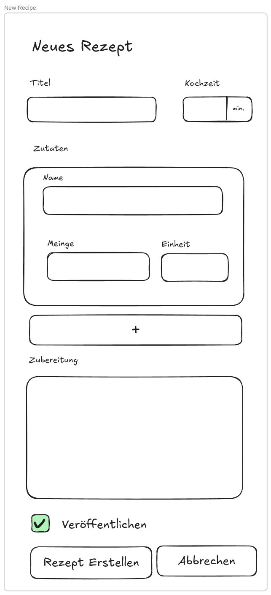
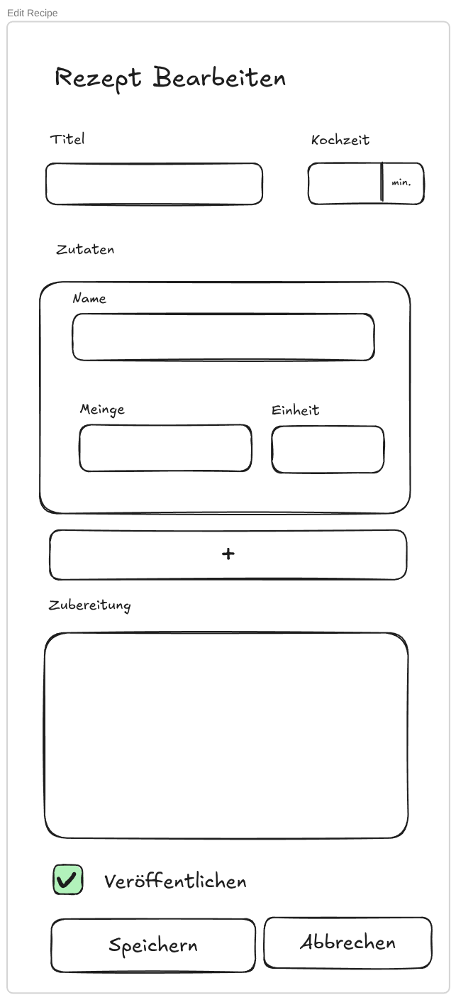
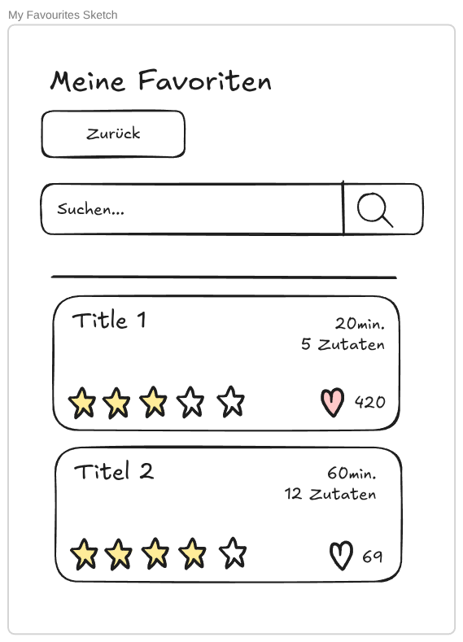
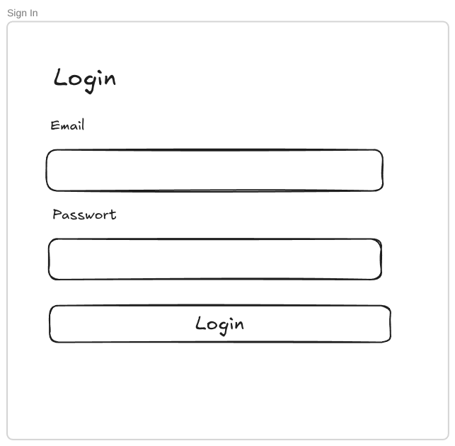
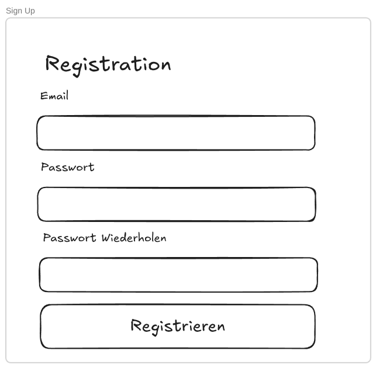

# Projektantrag & Dokumentation M223 Recipe Sharing App – SocialChef

- Modulname: 223 Multi-User-Applikationen objektorientiert realisieren
- Datum: 25.09.2026
- Autor: Pierre Wegmann
- Schulklasse: INA24C

## Problemstellung

Kennt ihr das: Ihr kommt am Abend nach Hause, wollt etwas kochen, aber ihr habt keine Ahnung, was ihr essen wollt? Ihr kocht immer die gleichen Rezepte und könnt diese nicht mehr sehen, aber ihr kennt auch keine Alternativen. Oder vielleicht habt ihr einen geraucht und im Rausch das geilste Gericht der Welt gekocht und wollt es A: Speichern, damit ihr es am nächsten Tag nicht vergisst und B: Es mit anderen Teilen, weil es so unfassbar gut schmeckt. Was auch immer der Fall ist: SocialChef ist hier, um eine Lösung für diese Probleme zu bieten!

## Projekt

- **Domäne:** Ernährung und Gesundheit
- **Name:** SocialChef
- **Vision:** SocialChef soll als soziale Plattform dienen, auf der Benutzer ihre Rezepte teilen und andere Rezepte ansehen, bewerten oder speichern können. Das Konzept ist ähnlich wie GitHub, nur mit Rezepten statt Code.

## Projektplanung: 1. MVP-Iteration

In der ersten Iteration liegt der Fokus auf den Kernfunktionen der kollaborativen Rezeptverwaltung. Dazu gehören das Erstellen, Bearbeiten, Löschen und Suchen von Rezepten, das Bewerten und Kommentieren sowie die Verwaltung einer persönlichen Favoritensammlung.

## Anforderungsanalyse

### Funktionale Anforderungen (priorisiert)

1. **Benutzerauthentifizierung:** Benutzer können sich registrieren, einloggen, ausloggen und ihr Profil verwalten.
2. **Rezept-CRUD:** Registrierte Benutzer können eigene Rezepte erstellen, anzeigen, bearbeiten und löschen.
3. **Suche & Filterung:** Benutzer können veröffentlichte Rezepte nach Titel filtern.
4. **Bewertungen & Kommentare:** Registrierte Benutzer können fremde Rezepte einmalig mit 1–5 Sternen bewerten und Kommentare hinterlassen.
5. **Persönliche Sammlung (Favoriten):** Registrierte Benutzer können Rezepte per Herz-Symbol zu ihrer persönlichen Favoritensammlung hinzufügen und wieder entfernen.
6. **Zugriffsschutz & Rechteverwaltung:** Nur der jeweilige Autor eines Rezeptes darf dieses bearbeiten oder löschen. Unangemeldete Gäste haben nur lesenden Zugriff auf öffentliche Rezepte.
7. **Logging:** Schreibende Aktionen werden automatisch protokolliert.

### Qualitätsattribute (nicht-funktionale Anforderungen)

1. **Datenkonsistenz bei parallelen Rezensionen:**
   Pessimistic Row-Level Locking (`with_lock`) und ein eindeutiger DB-Index verhindern Lost Updates und Doppelbewertungen bei zeitgleichen Zugriffen.
2. **Performance:**
   Suchanfragen sollen bei 2'000 Rezepten in unter **1,5 Sekunden** antworten. Formular- und Kommentar-Updates via Turbo Stream sollen in unter **300 ms** reagieren.
3. **Sicherheit, Autorisierung & Auditierung:**
   Pundit-Policies erzwingen serverseitige Rollen- und Besitzprüfungen. Bei Verstössen wird HTTP `403 Forbidden` zurückgegeben. Ein `after_action`-Filter erfasst alle schreibenden Aktionen in `ActivityLog`, inklusive Status, Methode, IP-Adresse und gefilterten Parametern.
4. **Fehlertoleranz:**
   Ungültige Eingaben führen zu HTTP `422 Unprocessable Content`. Die Formulardaten bleiben erhalten und Inline-Fehlermeldungen werden ohne vollständigen Seitenneuladen angezeigt.

### Benutzerrollen

- **Gast:** Kann öffentliche Rezepte suchen, lesen und Bewertungen ansehen. Kann sich registrieren und einloggen.
- **Mitglied:** Kann eigene Rezepte verwalten (Entwurf/Veröffentlicht), fremde Rezepte einmalig mit 1–5 Sternen und einem Text bewerten, Favoriten verwalten und das eigene Profil bearbeiten.
- **Admin:** Hat Moderationsrechte zum Löschen regelwidriger Rezepte und unangemessener Kommentare. Kann über den Pundit-Scope alle Entwürfe einsehen.

### Locking und Transaktionen

- **Transaktionen – Erstellung / Aktualisierung von Rezepten:**
  Das Rezept und die zugehörigen Zutaten werden innerhalb einer expliziten Datenbanktransaktion verarbeitet. Schlägt die Validierung einer Zutat oder des Rezepts fehl, wird mit `ActiveRecord::Rollback` die gesamte Transaktion zurückgesetzt. Dadurch werden Dateninkonsistenzen verhindert.
- **Pessimistic Locking – Rezensionsverwaltung:**
  Beim Erstellen und Löschen von Kommentaren wird der betroffene Rezept-Datensatz mittels Pessimistic Row-Level Locking gesperrt. Dadurch werden Lost Updates bei der dynamischen Durchschnittsbewertung (`comments.average(:rating)`) verhindert. Ein eindeutiger Datenbank-Index auf `[recipe_id, author_id]` verhindert parallele Mehrfachbewertungen auf Datenbankebene. Ein daraus entstehendes `RecordNotUnique` wird entsprechend behandelt.

### ERM

```text
Users
- email_address:string unique
- password_digest:string
- role:string, default: "member"
- recipes:references, many: Recipes
- comments:references, many: Comments
- favourites:references, many: Favourites
- sessions:references

Favourites
- user:references, one: User
- recipes:references, many: Recipes

Recipes
- title:string
- instructions:text
- prep_time_minutes:uint
- is_published:boolean, default: false
- ingredients:references, many: Ingredients
- comments:references, many: Comments
- favourites:references, many: Favourites

Ingredients
- name:string
- amount:uint, min: 1
- unit:string, max: 30
- recipe:references, one: Recipe

Comments
- title:string
- body:string optional
- rating:uint, min: 1, max: 5
- recipe:references, one: Recipe
- author:references, one: User
- Constraints:
  - unique (recipe, author)

ActivityLog
- user:references, one: User
- action:string (controller#action)
- details:json (status, method, ip, params)
```

### Breadboards

```text
@Recipe List (recipes#index)
  - Sign in / Sign up
    -> @Sign in
  - Go to my favourites
    Not signed in -> @Sign in
    Signed in -> @My Favourites
  - Create new recipe
    Not signed in -> @Sign in
    Signed in -> @New Recipe
  - Search by title (GET recipes#index)
    -> @Recipe List
  - Public recipe cards (title, average rating, ingredient count, prep time)
  - Open recipe
    -> @Recipe Detail

@Recipe Detail (recipes#show)
  - Title, author, instructions, publication status badge
  - Ingredients list (name, amount, unit)
  - Back to overview
    -> @Recipe List
  - Toggle favourite (PATCH favourite_recipes#toggle)
    Not signed in -> @Sign in
    Success -> @Recipe Detail
  - Edit recipe (author only)
    -> @Edit Recipe
  - Delete recipe (DELETE recipes#destroy) (author only)
    Success -> @Recipe List
  - Existing comments and ratings list (title, rating, body, author)
  - Add comment & rating (POST comments#create)
    Not signed in -> @Sign in
    Success -> @Recipe Detail
    Already commented -> @Recipe Detail
    Validation error -> @Recipe Detail

@New Recipe (recipes#new)
  - Title, instructions, is_published checkbox
  - Dynamic ingredient rows (name, amount, unit)
  - Save recipe (POST recipes#create)
    Success -> @Recipe Detail
    Validation error -> @New Recipe
  - Cancel
    -> @Recipe List

@Edit Recipe (recipes#edit)
  - Title, instructions, is_published checkbox
  - Manage ingredient rows (add, update, delete name, amount, unit)
  - Update recipe (PATCH recipes#update)
    Success -> @Recipe Detail
    Validation error -> @Edit Recipe
  - Cancel
    -> @Recipe Detail

@My Favourites (favourites#show)
  - List of favorited recipes
  - Open recipe
    -> @Recipe Detail
  - Remove from favourites (DELETE favourite_recipes#destroy)
    Success -> @My Favourites
  - Back to overview
    -> @Recipe List

@Sign in (sessions#new)
  - Email and password inputs
  - Sign in (POST sessions#create)
    Success -> @Recipe List
    Invalid credentials -> @Sign in
  - Go to sign up
    -> @Sign up

@Sign up (registrations#new)
  - Email and password inputs
  - Sign up (POST registrations#create)
    Success -> @Recipe List
    Validation error -> @Sign up
  - Go to sign in
    -> @Sign in
```

### Fat-Marker Sketches

#### Navigation (Layout)



#### Recipe List (recipes#index)



#### Recipe Detail (recipes#show)



#### New Recipe (recipes#new)



#### Edit Recipe (recipes#edit)



#### My Favourites (favourites#show)



#### Sign in (sessions#new)



#### Sign up (registrations#new)



## Erreichter Stand, Abweichungen & offene Punkte

- **Erreichter Stand:** Alle Kernfunktionen (Authentifizierung, Pundit-Autorisierung, DB-Transaktionen, Pessimistic Locking, Audit-Logging, Profil und Favoriten) wurden vollständig umgesetzt.
- **Begründete Abweichung:** Das Rating wird dynamisch mit `comments.average(:rating)` berechnet, anstatt Zähler-Spalten in `recipes` zu pflegen. Dadurch werden fehlerhafte Zählerstände bei Löschvorgängen vermieden.
- **Offene Punkte:** Bild-Uploads mit ActiveStorage und Kategorie-Tags sind für eine spätere Erweiterung vorgesehen.

## Nutzer

Das System besitzt 3 Demo-Nutzer. Alle nutzen "P4ssw0rd!" als Passwort.

- admin@test.com (admin)
- member1@test.com (member)
- member2@test.com (member)
